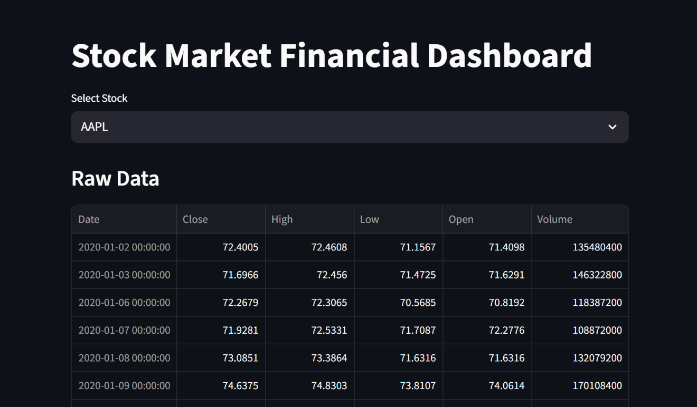
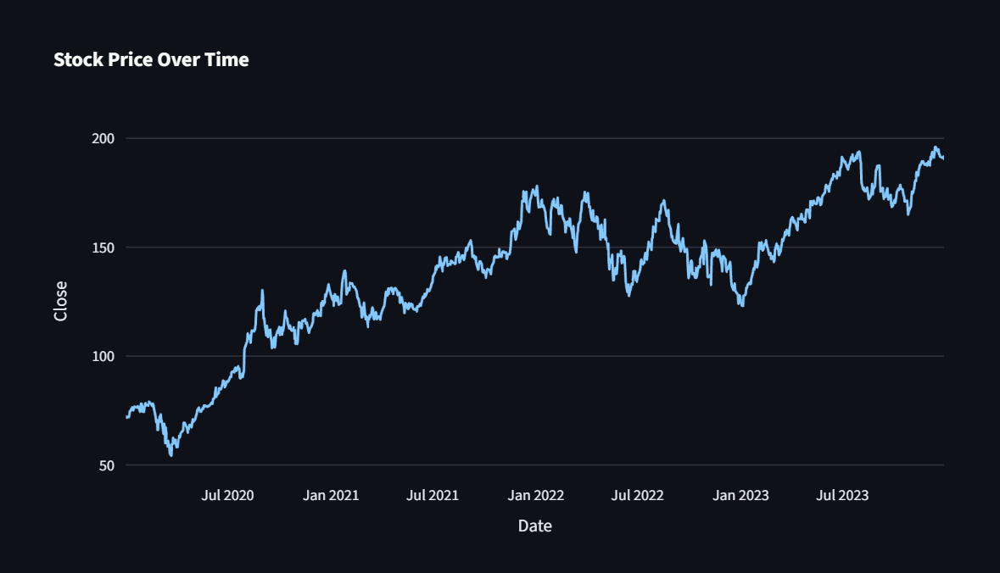
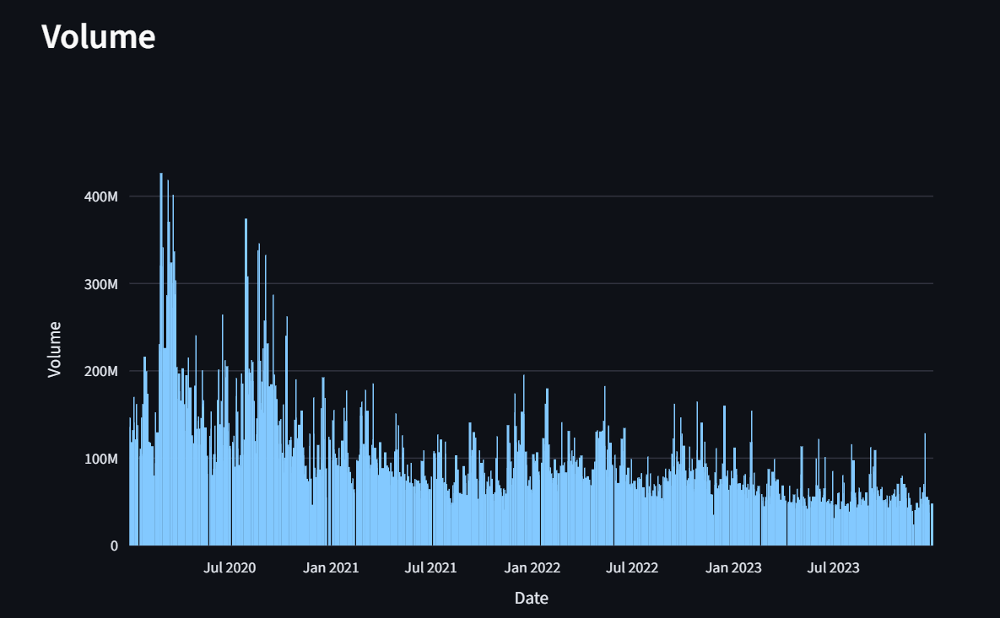

# Financial Dashboard Project

## Project Overview
This project presents an interactive financial dashboard analyzing stock market performance of Apple, Tesla, and Microsoft. 
The objective is to visualize historical trends in stock prices and trading volumes to support investment decision-making.

## Data Source
The dataset was obtained from Yahoo Finance API using the yfinance Python library. 
It contains daily stock price data including open, close, high, low, and trading volume.

## Steps & Methodology
Data was extracted using Python and cleaned using Pandas.
Streamlit was used to build an interactive dashboard.
Plotly was used for visualizations.

## Dashboard Screenshots

## Key Insights
The dashboard provides a comparative analysis of historical stock performance for Apple (AAPL), Tesla (TSLA), and Microsoft (MSFT) from 2020 to 2024.

From the stock price trend visualization:

Apple demonstrates a steady upward trend over the observed period, indicating consistent long-term growth and relatively stable market performance. While minor fluctuations occurred during periods of global economic uncertainty, the overall trajectory remained positive.

Tesla exhibits significantly higher volatility compared to the other stocks. There are noticeable sharp increases in price during 2020–2021 followed by periodic declines. This suggests that Tesla’s stock is more sensitive to market speculation and external factors such as technological developments and investor sentiment.

Microsoft shows gradual and stable growth throughout the selected time period. Compared to Tesla, Microsoft’s stock price movements are less volatile, making it potentially more suitable for risk-averse investors seeking steady returns.

From the trading volume bar chart:

Sudden spikes in trading volume are observed across all three stocks at various points in time. These spikes may correspond to major financial announcements, earnings reports, or global economic events that influenced investor behavior.

Tesla generally records higher fluctuations in trading volume, reflecting greater investor activity and speculative trading compared to Apple and Microsoft.

Consistent trading volume in Apple and Microsoft suggests stable investor interest and lower short-term speculative activity.

Overall, the analysis indicates that while Tesla offers the potential for higher short-term gains due to its volatility, Apple and Microsoft present more stable growth trends that may be more suitable for long-term investment strategies.

## Live Dashboard Link
https://financial-dashboard-hqrpgvgbpvsiiqbqnqjpf5.streamlit.app/

## Assumptions & Limitations
This dashboard is developed based on historical stock market data obtained from Yahoo Finance using the yfinance Python library. The analysis assumes that the retrieved financial data is accurate and free from errors or inconsistencies.

Several assumptions were made during the development of this dashboard. Firstly, it is assumed that past stock price performance can provide meaningful insights into general market trends and investor behavior. Additionally, the analysis assumes that trading volume can serve as an indicator of investor interest and market activity.

However, there are certain limitations associated with this project. The dashboard relies solely on historical data and does not incorporate predictive models or forecasting techniques. Therefore, it should not be used as a tool for making real-time investment decisions.

External factors such as economic policies, geopolitical events, inflation, interest rate changes, and company-specific news are not considered in this analysis, even though they can significantly impact stock market performance.

Furthermore, the dashboard analyzes a limited number of companies and does not represent the entire stock market. As a result, the insights derived from this analysis may not be generalizable to all sectors or financial instruments.
